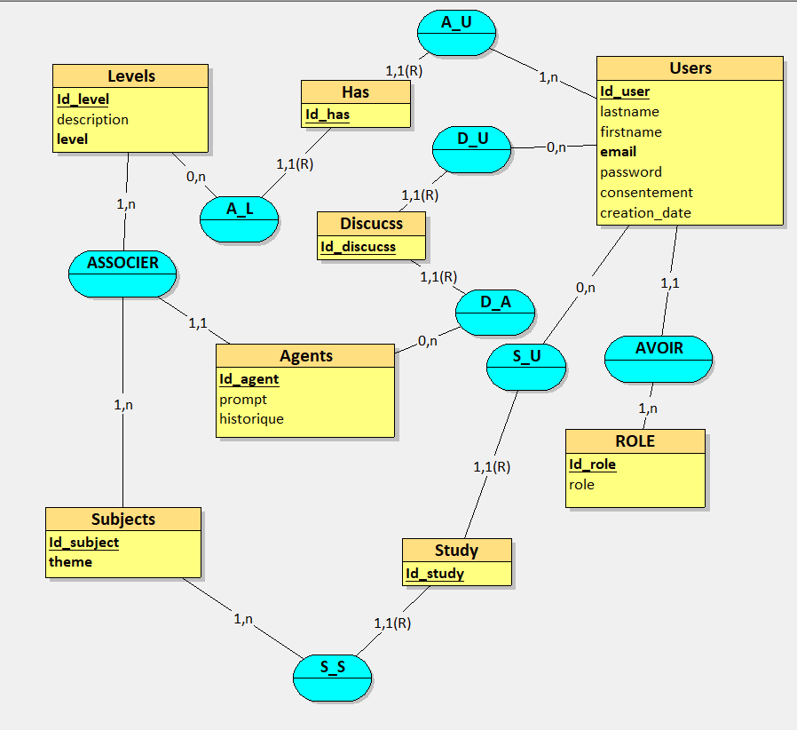
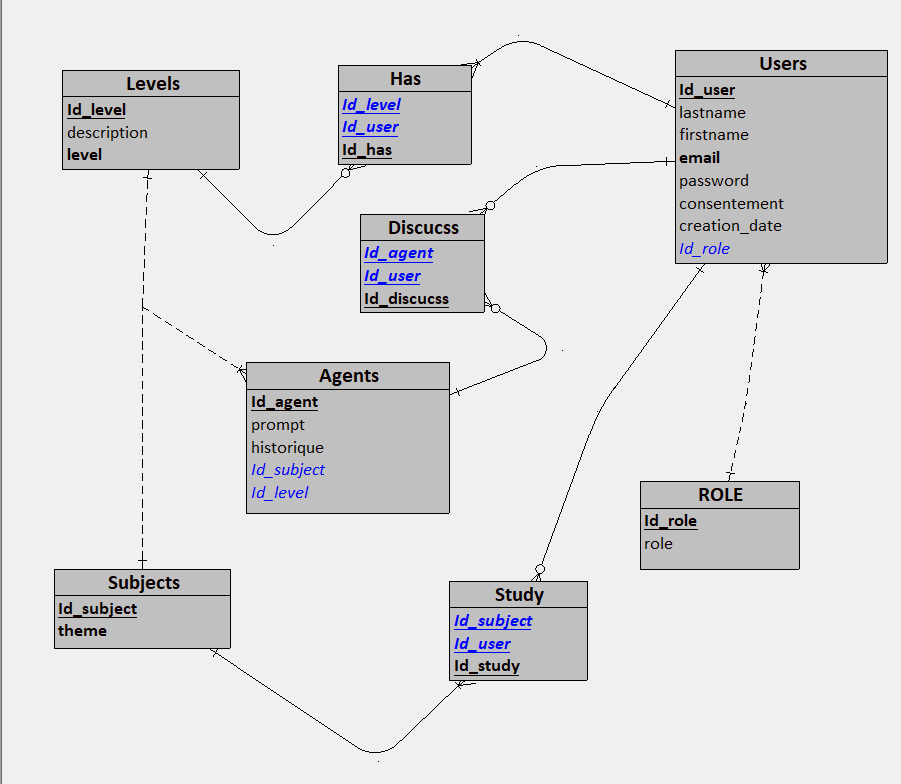
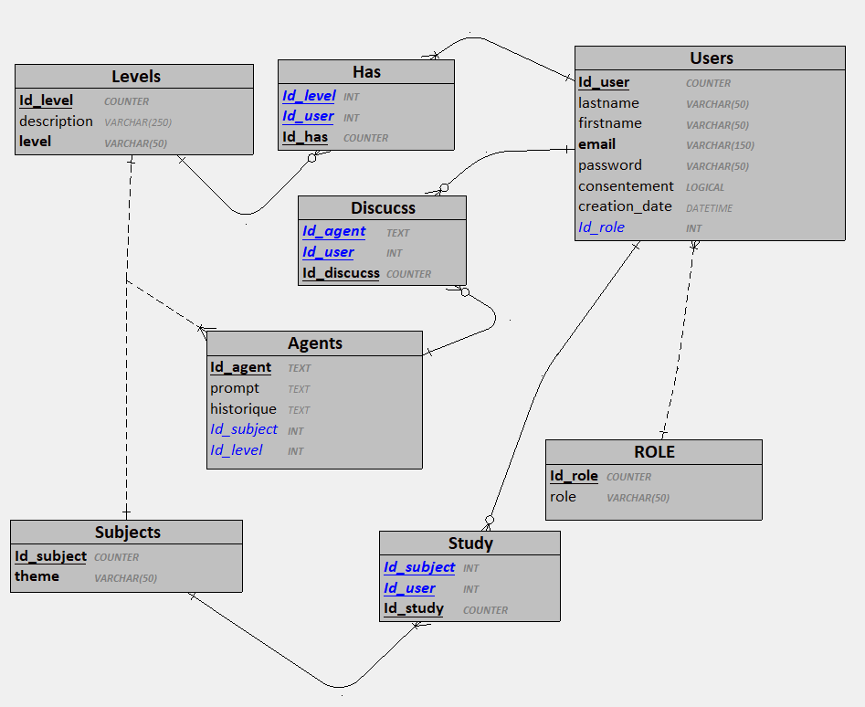

# PlateformeIAEducativeAvecAgent
## Architecture du projet
```bash
PlateformeIAEducativeAvecAgent/
│
├── App/
│   ├── config/
│   │   ├── Autoloader.php   ✅ (on va le créer ici)
│   │   ├── Database.php
│   │   └── config.php
│   │
│   ├── Controllers/
│   │   ├── UserController.php
│   │   ├── AgentsController.php
│   │   ├── LevelsController.php
│   │   └── RoleController.php
│   │
│   ├── Models/
│   │   ├── Users.php
│   │   ├── Agents.php
│   │   ├── Levels.php
│   │   └── Roles.php
│   │
│   └── Views/
│       ├── login.php
│       ├── user_list.php
│       └── user_registration.php
│
└── public/
    └── index.php  ✅ (point d’entrée)

```

---

## Le Modèle Conceptuel de Données


## Le Modèle Logique de Données


## Le Modèle Physique de Données


:)